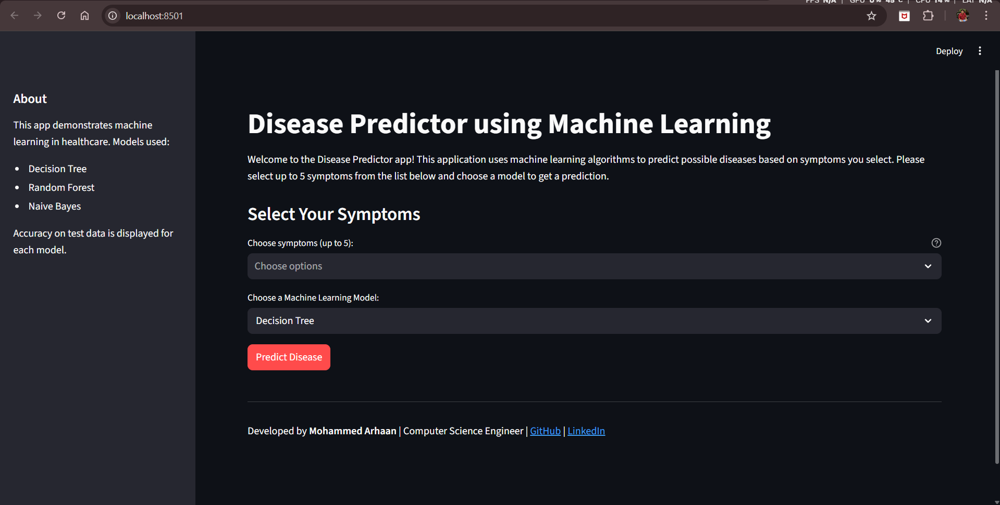

# Disease Predictor using Machine Learning 🩺

A Streamlit web application that predicts diseases based on user-selected symptoms using Machine Learning models.

Developed by Mohammed Arhaan.

---

## Features

- Select up to 5 symptoms from 95 available symptoms
- Choose between multiple machine learning models:
  - Decision Tree
  - Random Forest
  - Naive Bayes
- Predict disease instantly
- Display model accuracy
- Interactive Streamlit web interface

---

## Technologies Used

- Python
- Streamlit
- Scikit-learn
- Pandas
- NumPy

---

## Project Structure

disease-predictor-ml/

app.py  
predictor.py  
Training.csv  
Testing.csv  
requirements.txt  
README.md  

---

## How to Run

Step 1: Clone repository

git clone https://github.com/SNE0X/disease-predictor-ml.git

Step 2: Go to folder

cd disease-predictor-ml

Step 3: Install dependencies

pip install -r requirements.txt

Step 4: Run application

streamlit run app.py

---

## How It Works

- User selects symptoms
- Application converts symptoms into binary format
- Machine learning model predicts disease
- Displays predicted disease and accuracy

---

## Screenshot

---

## Disclaimer

This project is for educational purposes only and not intended for medical diagnosis.

---

## Author

Mohammed Arhaan  
GitHub: https://github.com/SNE0X  
LinkedIn: https://linkedin.com/in/mohammed-arhaan-87742138b  
